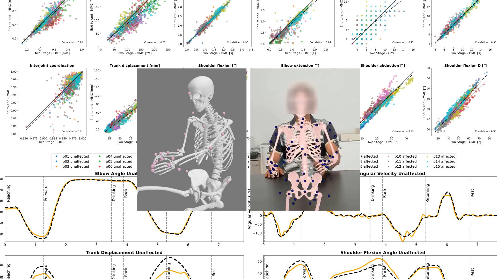

<div align="center">

# Differentiable Biomechanics for Markerless Motion Capture in Upper Limb Stroke Rehabilitation: A Comparison with Optical Motion Capture

[Tim Unger](https://www.llui.org/lab/computer-vision-lab/)<sup>*1, </sup><sup>4</sup>, [Arash Sal Moslehian](https://moslehian.com)<sup>*2</sup>, [J.D. Peiffer](https://www.sralab.org/researchers/jd-peiffer)<sup>*3</sup>, Johann Ullrich<sup>1, </sup><sup>4</sup>, Roger Gassert<sup>4</sup>, Olivier Lambercy<sup>4</sup>, R. James Cotton<sup>†5</sup> , Chris Awai Easthope<sup>†1</sup>

<sup>1</sup>Data Analytics & Rehabilitation Technology (DART Lab), Lake Lucerne Institute, Vitznau, Switzerland <br>
<sup>2</sup>Neuro-X Institute, EPFL, Lausanne, Switzerland <br>
<sup>3</sup>Dept of Biomedical Engineering, Northwestern University, Chicago, IL <br>
<sup>4</sup>RELab, ETH, Zurich, Switzerland <br>
<sup>5</sup>Shirley Ryan AbilityLab, Dept of PM&R, Northwestern University, Chicago, IL <br>
<sup>*</sup>co-first author <br>
<sup>†</sup>co-senior author <br>



</div>

> This repository includes the analysis code of our ICORR 2025 Paper.

# Abstract
*Background*.
Combining differentiable biomechanical modeling with Markerless Motion Capture (MMC) offers a promising approach to motion capture in clinical settings, requiring minimal equipment and effort for data collection. Currently, marker-based Optical Motion Capture (OMC) paired with biomechanical modeling is considered the most precise and accurate method for measuring human movement kinematics.

*Methods*.
This study compares key kinematic outcomes from biomechanically modeled MMC and OMC data in 15 stroke patients performing the drinking task. 

*Results*.
We observed a high level of agreement in kinematic trajectories between MMC and OMC, as indicated by high correlations between systems (median $r > 0.95$ for majority of kinematics) and median $\text{RMSE}$ values ranging from approximately $2^\circ$–$5^\circ$ for joint angles, $0.04 \, \text{m/s}$ for end-effector velocity, and $6 \, \text{mm}$ for trunk displacement). Trial-to-trial biases between OMC and MMC were consistent within patient sessions, with interquartile ranges of bias around $1-3^\circ$ for joint angles, $0.01m/s$ in end-effector velocity, and approximately $3 \, \text{mm}$ for trunk displacement. 

*Conclusion*.
Our findings indicate that MMC for arm tracking is approaching the accuracy and precision of marker-based methods, supporting its potential for use in clinical settings. MMC could provide valuable insights into movement rehabilitation in stroke patients, potentially enhancing the effectiveness of rehabilitation strategies.

# The Code
Will be hosted here after the publication.

# Dataset
We are actively working on getting the rights to publishing the anonymized patient dataset for this work. Once done, the data will be linked here.

# Citation

```bibtex
@inproceedings{tba,
  title={{tba}},
  author={tba},
  booktitle={tba},
  year={2025}
}
```
